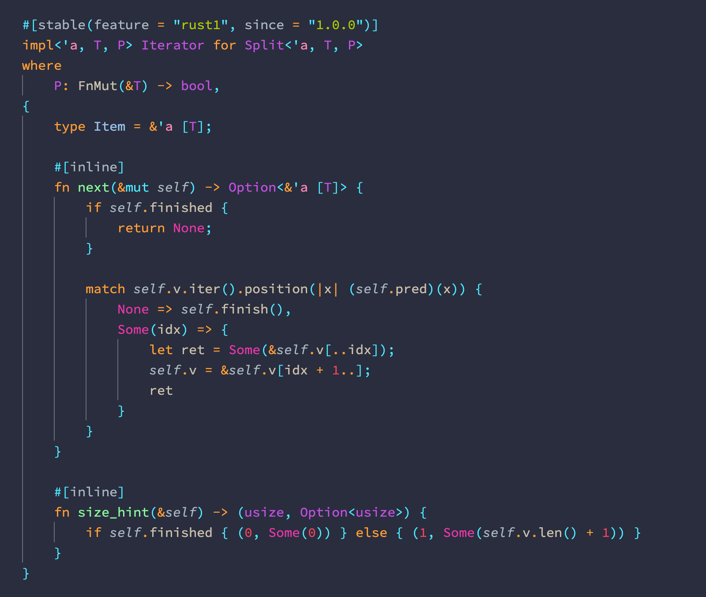

# Rust Syntax

This extension provides a TextMate-style grammar for Rust, with the following goals:

- Every item on the page should have at least one scope for themes to target.
- It should be possible to visually distinguish declarations and invocations (function names, types—this may require disabling semantic highlighting).
- All punctuation should be themeable.
- Punctuation should be separated from its contents (example: quotation marks can be themed separately from strings).
- Some punctuation can be themed differently depending on context (example: angled brackets in types versus comparison operators).
- When appropriate, meta scopes should allow other scopes to shine through (examples: including strings in attributes, string interpolation using the `interpolate` crate).

Rust Syntax can be used in conjunction with Rust Language Server or Rust Analyzer, as it only provides syntax highlighting.

If you need a theme that works out of the box with this grammar, please check out [Yarra Valley][]:

[Yarra Valley]: https://marketplace.visualstudio.com/items?itemName=dustypomerleau.yarra-valley
